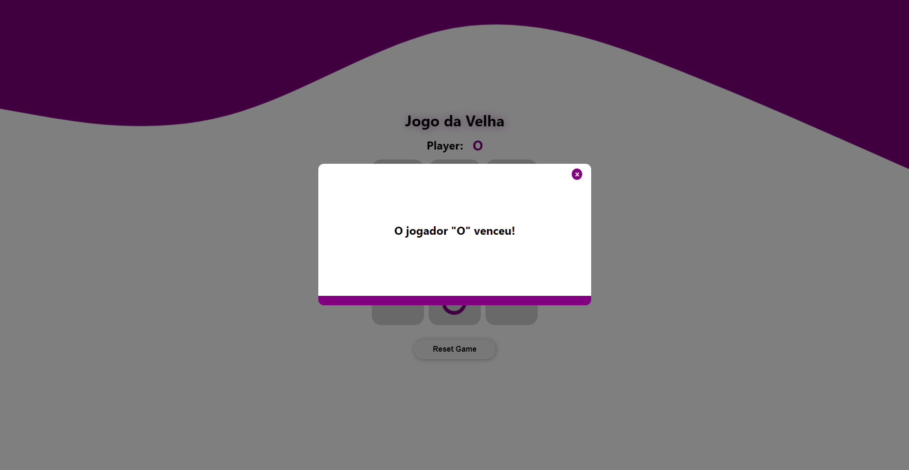

# Jogo da Velha

By: Davi Lucciola

Jogo da velha feito com ReactJS

- [Clique aqui para jogar](https://tic-tac-toe-chi-ecru.vercel.app/)

### Iniciando local

> `git clone https://github.com/davi-lucciola/TicTacToe.git`

> `cd TicTacToe`

> `pnpm install` (Pode ser com qualquer gerenciador de pacotes.)

> `pnpm run dev`

Pronto! Agora o projeto está rodando localmente!
